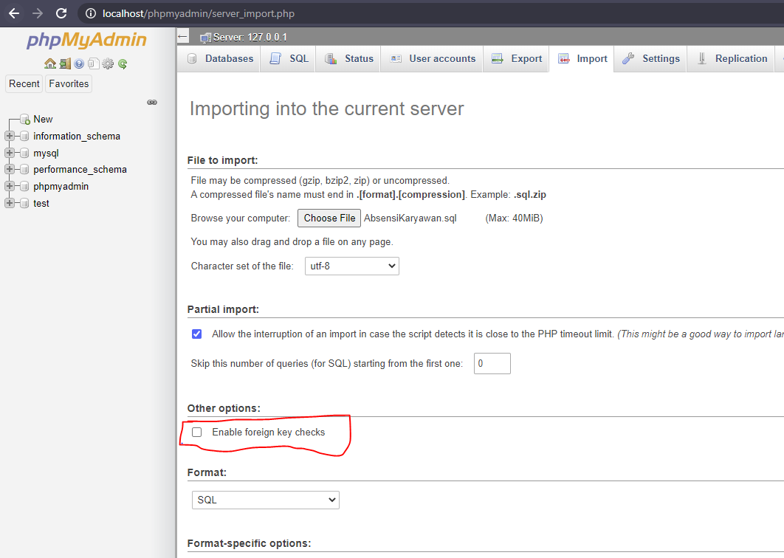

# Absensi Karyawan
Aplikasi absensi karyawan yang dibuat menggunakan bahasa pemograman Java dengan GUI toolkit [Swing](https://en.wikipedia.org/wiki/Swing_(Java)),
menerapkan konsep-konsep OOP seperti Inheritance, Abstraction, dll

## Cara Menjalankan
- Install dahulu [Java 11 JDK](https://www.oracle.com/java/technologies/javase-jdk11-downloads.html) karena aplikasi ini dibuat menggunakan
JDK Java versi 11
- Install [XAMPP](https://www.apachefriends.org/index.html) (direkomendasikan install versi terbaru)
- Download atau clone aplikasinya dari repository ini
- Jalankan XAMPP dan aktifkan service **Apache** dan **MySQL**
- Buka phpmyadmin dengan mengunjungi link **localhost/phpmyadmin** di browser, setelah menjalankan service **Apache** dan **MySQL**
- Klik "import" lalu "Choose File" dan pilih file **AbsensiKaryawan.sql** yang sudah di download tadi, uncheck "Enable foreign key checks", jika sudah,
klik "Go" yang ada di bawah untuk mulai import database

- Jalankan aplikasi ini dengan klik dua kali file **AbsenKaryawan.jar** yang sudah di download. Jika terjadi error pastikan bahwa versi Java yang diinstall adalah [**Java 11 SDK**](https://www.oracle.com/java/technologies/javase-jdk11-downloads.html)

## Catatan
- Demo untuk login bisa menggunakan user **TONO** atau user **ADMIN** dengan password yaitu **password** (untuk kedua user tersebut)
- **Aplikasi ini tidak bisa dibuka "Open Project" menggunakan NetBeans**, hal itu dikarenakan aplikasi ini dibuat menggunakan IDE [IntelliJ IDEA](https://www.jetbrains.com/idea/), dan IntelliJ dengan NetBeans menggunakan struktur project yang berbeda sehingga project yang dibuat dengan IntelliJ tidak bisa dibuka di NetBeans, begitupun sebaliknya

## Gambar

